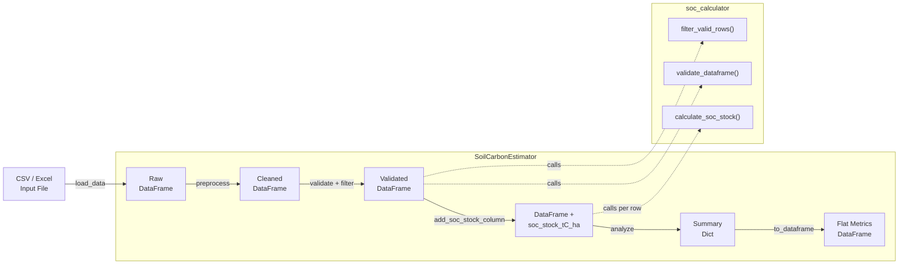

# Soil Carbon Estimator

A Python toolkit for estimating soil organic carbon (SOC) stocks from field measurements, designed for tropical and subtropical sites. It automates data validation, SOC calculation using the standard bulk-density formula, and generates summary statistics for environmental research and land-use analysis.

## Features

- Load soil data from CSV or Excel files
- Automated SOC stock calculation (tC/ha) using the standard bulk-density formula
- Input validation with clear error messages for out-of-range and missing values
- Column-name normalisation and data cleaning
- Summary statistics (mean, min, max, totals) per numeric column
- Immutable data pipeline -- all transformations return new objects, never mutate inputs
- 42 unit and integration tests with pytest

## Quick Start

```bash
# Clone the repository
git clone https://github.com/achmadnaufal/soil-carbon-estimator.git
cd soil-carbon-estimator

# Create a virtual environment and install dependencies
python -m venv .venv
source .venv/bin/activate
pip install -r requirements.txt

# Run the estimator on the demo dataset
python -c "
from src.main import SoilCarbonEstimator
result = SoilCarbonEstimator().run('demo/sample_data.csv')
print(f\"Records: {result['total_records']}\")
print(f\"Mean SOC: {result['soc_stats']['mean_tC_ha']} tC/ha\")
"
```

## Usage

### Full pipeline on the included demo data

```python
from src.main import SoilCarbonEstimator

estimator = SoilCarbonEstimator()
result = estimator.run("demo/sample_data.csv")

print(f"Records processed: {result['total_records']}")
print(f"Mean SOC stock:    {result['soc_stats']['mean_tC_ha']} tC/ha")
print(f"Total SOC stock:   {result['soc_stats']['total_tC_ha']} tC/ha")
```

### Single SOC stock calculation

```python
from src.soc_calculator import calculate_soc_stock

# calculate_soc_stock(bulk_density_g_cm3, organic_carbon_pct, depth_cm)
stock = calculate_soc_stock(1.12, 2.85, 30)
print(f"SOC stock: {stock} tC/ha")
# SOC stock: 95.76 tC/ha
```

### Sample output

Running the full pipeline on `demo/sample_data.csv` (20 tropical soil sites):

```
=== Soil Carbon Estimator ===
File: demo/sample_data.csv
Records processed: 20

--- SOC Stock Summary ---
  mean_tC_ha: 75.86
  min_tC_ha: 41.75
  max_tC_ha: 121.34
  total_tC_ha: 1517.16
  n_valid: 20

--- Column Means ---
  latitude: -6.832
  longitude: 107.38
  depth_cm: 27.0
  bulk_density_g_cm3: 1.202
  organic_carbon_pct: 2.441
  clay_pct: 36.0
  soc_stock_tC_ha: 75.858
```

### Running tests

```bash
pytest tests/ -v
```

```
tests/test_estimator.py::TestCalculateSOCStock::test_basic_calculation PASSED
tests/test_estimator.py::TestCalculateSOCStock::test_zero_organic_carbon_returns_zero PASSED
tests/test_estimator.py::TestRunPipeline::test_run_on_sample_csv PASSED
...
============================== 42 passed in 0.25s ==============================
```

## Tech Stack

| Tool | Purpose |
|------|---------|
| **Python 3.9+** | Core language |
| **pandas** | Data loading, transformation, and analysis |
| **NumPy** | Numeric computation and array operations |
| **SciPy** | Statistical utilities |
| **Rich** | Terminal formatting |
| **pytest** | Testing framework with coverage reporting |

## Architecture



### Data flow

1. **Load** -- `SoilCarbonEstimator.load_data()` reads CSV or Excel into a pandas DataFrame.
2. **Preprocess** -- Column names are normalised (lowercased, whitespace stripped), fully-empty rows are dropped.
3. **Validate & Filter** -- `validate_dataframe()` checks required columns exist and are numeric. `filter_valid_rows()` drops rows outside physical ranges (e.g., bulk density > 2.65 g/cm3).
4. **Calculate** -- `add_soc_stock_column()` applies the SOC formula row-by-row: `BD * (OC% / 100) * depth * 100`.
5. **Analyse** -- Descriptive statistics, column means, totals, and SOC-specific summary metrics are computed.
6. **Export** -- `to_dataframe()` flattens the result dict into a two-column metrics table for downstream use.

## Project Structure

```
soil-carbon-estimator/
├── src/
│   ├── __init__.py
│   ├── main.py             # SoilCarbonEstimator pipeline class
│   ├── soc_calculator.py   # Pure SOC calculation and validation functions
│   └── data_generator.py   # Synthetic data generator
├── tests/
│   └── test_estimator.py   # 42 tests across 8 test classes
├── demo/
│   └── sample_data.csv     # 20-row tropical soil dataset
├── sample_data/
│   └── sample_data.csv     # Standalone sample for quick testing
├── examples/
│   └── basic_usage.py      # Runnable usage example
├── requirements.txt
├── LICENSE
└── README.md
```

> Built by [Achmad Naufal](https://github.com/achmadnaufal) | Lead Data Analyst | Power BI · SQL · Python · GIS
