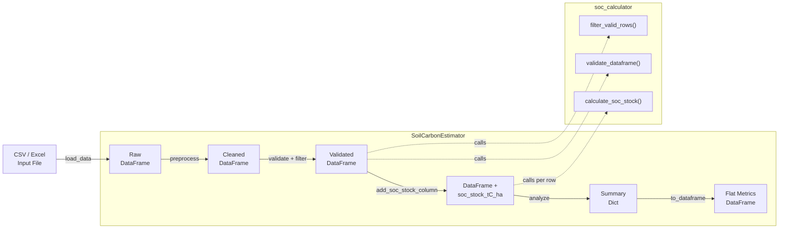

# Soil Carbon Estimator

A Python toolkit for estimating soil organic carbon (SOC) stocks from field measurements, designed for tropical and subtropical sites (including Indonesian conditions). It automates data validation, SOC calculation using the standard bulk-density formula, and generates summary statistics for environmental research and land-use analysis.

## Features

- Load soil data from CSV or Excel files
- Automated SOC stock calculation (tC/ha) using the standard bulk-density formula
- Input validation with clear error messages for out-of-range and missing values
- Column-name normalisation and data cleaning
- Summary statistics (mean, min, max, totals) per numeric column
- Immutable data pipeline -- all transformations return new objects, never mutate inputs
- **SOC saturation deficit** via the Hassink (1997) pedotransfer function -- estimate how much more carbon a soil can stabilise before reaching its clay+silt protection limit
- Comprehensive unit and integration tests with pytest (80%+ coverage target)

## Quick Start

```bash
# 1. Clone the repository
git clone https://github.com/achmadnaufal/soil-carbon-estimator.git
cd soil-carbon-estimator

# 2. Create a virtual environment and install dependencies
python -m venv .venv
source .venv/bin/activate        # Windows: .venv\Scripts\activate
pip install -r requirements.txt

# 3. Run the estimator on the included demo dataset
python -c "
from src.main import SoilCarbonEstimator
result = SoilCarbonEstimator().run('demo/sample_data.csv')
print(f\"Records: {result['total_records']}\")
print(f\"Mean SOC: {result['soc_stats']['mean_tC_ha']} tC/ha\")
print(f\"Total SOC: {result['soc_stats']['total_tC_ha']} tC/ha\")
"
```

## Usage

### Full pipeline on the included demo data

```python
from src.main import SoilCarbonEstimator

estimator = SoilCarbonEstimator()
result = estimator.run("demo/sample_data.csv")

print(f"Records processed: {result['total_records']}")
print(f"Mean SOC stock:    {result['soc_stats']['mean_tC_ha']} tC/ha")
print(f"Total SOC stock:   {result['soc_stats']['total_tC_ha']} tC/ha")
```

### Using your own DataFrame

```python
import pandas as pd
from src.main import SoilCarbonEstimator

df = pd.read_csv("your_data.csv")
estimator = SoilCarbonEstimator()
result = estimator.analyze(df)

print(f"Records processed : {result['total_records']}")
if "soc_stats" in result:
    print(f"Mean SOC stock    : {result['soc_stats']['mean_tC_ha']} tC/ha")
    print(f"Valid SOC records : {result['soc_stats']['n_valid']}")
```

### Single SOC stock calculation

```python
from src.soc_calculator import calculate_soc_stock

# calculate_soc_stock(bulk_density_g_cm3, organic_carbon_pct, depth_cm)
stock = calculate_soc_stock(1.12, 2.85, 30)
print(f"SOC stock: {stock} tC/ha")
# SOC stock: 95.76 tC/ha
```

### SOC saturation deficit (Hassink 1997)

Estimate how much additional carbon a soil can physically stabilise on its
fine mineral fraction (clay + silt). Useful for MRV, carbon-farming
feasibility, and ranking sites by sequestration headroom.

```python
from src.soc_saturation import SaturationInputs, calculate_saturation

inputs = SaturationInputs(
    clay_pct=45.0,
    silt_pct=20.0,
    bulk_density_g_cm3=1.15,
    depth_cm=30.0,
    current_soc_stock_tC_ha=55.0,
)

result = calculate_saturation(inputs)
print(f"C saturation:        {result.c_sat_stock_tC_ha} tC/ha")
print(f"Saturation deficit:  {result.saturation_deficit_tC_ha} tC/ha")
print(f"Saturation ratio:    {result.saturation_ratio:.2f}")
```

Batch-process a DataFrame of sites:

```python
import pandas as pd
from src.soc_saturation import add_saturation_columns, summarise_saturation

df = pd.read_csv("sample_data/soc_saturation_scenarios.csv")
enriched = add_saturation_columns(df)
summary = summarise_saturation(enriched)
print(summary)
# {'mean_deficit_tC_ha': ..., 'total_deficit_tC_ha': ...,
#  'mean_ratio': ..., 'n_saturated': ..., 'n_valid': 20}
```

### Export results to a flat DataFrame

```python
from src.main import SoilCarbonEstimator

estimator = SoilCarbonEstimator()
result = estimator.run("demo/sample_data.csv")

metrics_df = estimator.to_dataframe(result)
print(metrics_df.to_string(index=False))
```

## Sample Output

Running the full pipeline on `demo/sample_data.csv` (20 tropical soil sites across West Java and Central Java, Indonesia):

```
=== Soil Carbon Estimator ===
File: demo/sample_data.csv
Records processed: 20

--- SOC Stock Summary ---
  mean_tC_ha  : 75.86
  min_tC_ha   : 41.75
  max_tC_ha   : 121.34
  total_tC_ha : 1517.16
  n_valid     : 20

--- Column Means ---
  latitude              : -6.832
  longitude             : 107.380
  depth_cm              : 27.000
  bulk_density_g_cm3    : 1.201
  organic_carbon_pct    : 2.441
  clay_pct              : 36.000
  soc_stock_tC_ha       : 75.860
```

### Sample data preview (`demo/sample_data.csv`)

| site_id | depth_cm | bulk_density_g_cm3 | organic_carbon_pct | land_use | soc_stock_tC_ha |
|---------|----------|--------------------|--------------------|----------------|-----------------|
| TH001 | 30 | 1.12 | 2.85 | tropical_forest | 95.76 |
| TH002 | 30 | 1.08 | 3.41 | tropical_forest | 110.48 |
| TH003 | 20 | 1.25 | 1.92 | cropland | 48.00 |
| TH006 | 20 | 1.05 | 4.12 | peatland | 86.52 |
| TH013 | 30 | 1.07 | 3.78 | tropical_forest | 121.34 |

## New: SOC Stock Change Calculator

Compute the change in soil organic carbon stock between two paired survey
datasets, the annualised accrual rate, and 95 % confidence-interval
uncertainty bands propagated from per-site measurement error.

### Step-by-step usage

**1. Prepare two survey DataFrames** (each must have a `site_id` column and
a `soc_stock_tC_ha` column — the output of the existing pipeline works
directly):

```python
import pandas as pd
from src.main import SoilCarbonEstimator

estimator = SoilCarbonEstimator()
result_2020 = estimator.run("data/survey_2020.csv")   # earlier survey
result_2024 = estimator.run("data/survey_2024.csv")   # later survey

# Or use plain DataFrames
survey_t0 = pd.read_csv("data/survey_2020.csv")
survey_t1 = pd.read_csv("data/survey_2024.csv")
```

**2. Compute per-site stock change:**

```python
from src.stock_change_calculator import compute_stock_change

change_df = compute_stock_change(
    survey_t0=survey_t0,
    survey_t1=survey_t1,
    years_elapsed=4.0,          # years between the two surveys
    site_id_col="site_id",      # column that identifies each sampling site
)

print(change_df.to_string(index=False))
# site_id  soc_t0_tC_ha  soc_t1_tC_ha  delta_soc_tC_ha  annual_rate_tC_ha_yr  ci_lower_tC_ha  ci_upper_tC_ha
#   TH001         95.76        103.80             8.04                  2.01           -4.25           20.33
#   TH002        110.48        118.00             7.52                  1.88           -5.31           20.35
```

**3. Get an aggregate summary with confidence intervals:**

```python
from src.stock_change_calculator import summarise_stock_change

summary = summarise_stock_change(change_df, years_elapsed=4.0)

print(f"Sites analysed       : {summary.n_sites}")
print(f"Mean delta SOC       : {summary.mean_delta_tC_ha} tC/ha")
print(f"Total delta SOC      : {summary.total_delta_tC_ha} tC/ha")
print(f"Mean annual rate     : {summary.mean_annual_rate_tC_ha_yr} tC/ha/yr")
print(f"95% CI on mean delta : [{summary.ci_lower_tC_ha}, {summary.ci_upper_tC_ha}] tC/ha")
```

**4. Optionally supply per-site measurement error** to get more precise
uncertainty bands (column must be present in both DataFrames):

```python
change_df = compute_stock_change(
    survey_t0=survey_t0,
    survey_t1=survey_t1,
    years_elapsed=4.0,
    error_col="error_tC_ha",    # 1-sigma absolute error in tC/ha
)
```

When `error_col` is omitted a conservative 5 % relative uncertainty is
assumed for both surveys.

> **Note:** only sites present in **both** surveys (inner join on
> `site_id_col`) are included in the output.  Sites unique to one survey
> are silently excluded.

---

## New: Depth-Profile Harmonisation

Field surveys rarely sample SOC at the same depths, but downstream
reporting standards (IPCC GPG, FAO GSOC, Verra VM0042) require stocks
harmonised to a reference depth such as **0-30 cm** or **0-100 cm**.
The `src.depth_profile` module provides three pure functions that
resample, integrate, and harmonise irregular SOC profiles.

### Quick Start: harmonise an irregular profile to 0-30 cm

```python
from src.depth_profile import integrate_soc_to_depth

# Per-horizon SOC stocks measured at three depths (0-10, 10-20, 20-40 cm)
depths_cm = [10.0, 20.0, 40.0]
stocks    = [25.0, 22.0, 18.0]   # tC/ha per horizon

stock_30cm = integrate_soc_to_depth(depths_cm, stocks, target_depth_cm=30)
print(f"SOC 0-30 cm: {stock_30cm} tC/ha")
# SOC 0-30 cm: 56.0 tC/ha
```

### Step-by-step usage

**1. Interpolate a per-horizon profile onto any depth grid**:

```python
from src.depth_profile import interpolate_soc_profile

# Resample onto a regular 5 cm grid
grid = list(range(5, 41, 5))
stocks_on_grid = interpolate_soc_profile(depths_cm, stocks, grid)
```

**2. Integrate to a reference depth (with optional exponential
extrapolation beyond the deepest sample)**:

```python
# Within the measured range
stock_30 = integrate_soc_to_depth(depths_cm, stocks, target_depth_cm=30)

# Beyond the deepest sample - fits an exponential decay model
stock_100 = integrate_soc_to_depth(depths_cm, stocks, target_depth_cm=100)

# Disable extrapolation to fail loudly instead of fitting a model
try:
    integrate_soc_to_depth(depths_cm, stocks, 100, extrapolate=False)
except ValueError as e:
    print(e)
```

**3. Harmonise a long-format multi-site DataFrame**:

```python
import pandas as pd
from src.depth_profile import harmonise_to_reference_depth

long_df = pd.DataFrame({
    "site_id":         ["TH001", "TH001", "TH002", "TH002", "TH002"],
    "depth_cm":        [10,      30,      10,      20,      40],
    "soc_stock_tC_ha": [25.0,    22.0,    28.0,    24.0,    18.0],
})

harmonised = harmonise_to_reference_depth(long_df, target_depth_cm=30)
print(harmonised.to_string(index=False))
# site_id  soc_stock_tC_ha  reference_depth_cm  n_horizons
#   TH001            47.00                30.0           2
#   TH002            58.00                30.0           3
```

> **Note:** stocks are treated as the carbon contained *within* each
> horizon (not point densities).  When the target depth lies between
> two sampled horizons the cumulative-stock curve is linearly
> interpolated; for targets beyond the deepest sample an exponential
> decay model is fitted (Bernoux et al., 1998) and integrated
> analytically.

---

## New: Command-Line Interface

The package now ships with an argparse-based CLI (`python -m src.cli`)
that exposes the most common analyst workflows without writing any
Python.  All sub-commands read/write CSV (or JSON for `analyze`) so they
slot cleanly into shell pipelines and Makefile targets.

### Sub-commands

| Command | Purpose |
|---------|---------|
| `analyze` | Full `SoilCarbonEstimator` pipeline on a CSV/Excel file. |
| `harmonise` | Harmonise a long-format profile dataset to a reference depth. |
| `stock-change` | Compare two epochs (baseline vs monitoring) per site. |
| `generate` | Create a synthetic demo dataset for quick experiments. |

### Step-by-step usage

```bash
# 1. Run the full estimation pipeline on the demo data, JSON output.
python -m src.cli analyze demo/sample_data.csv --format json -o report.json

# 2. Harmonise a long-format profile dataset to 0-30 cm.
python -m src.cli harmonise profiles.csv --depth 30 -o harmonised.csv

# 3. Compute per-site SOC stock change over a 4-year interval.
python -m src.cli stock-change baseline.csv monitoring.csv \
    --years 4 --aggregate -o summary.csv

# 4. Generate a reproducible 50-row synthetic dataset.
python -m src.cli generate --rows 50 --seed 42 -o synthetic.csv
```

Every sub-command supports `-h/--help` for a full option reference.

---

## New: Plotting Utilities

`src/plotting.py` provides three pure helper functions that each return
a `matplotlib.figure.Figure` — callers decide where to persist them.
matplotlib is imported **lazily**, so the rest of the package remains
importable without it.

```python
import pandas as pd
from src.plotting import (
    plot_soc_histogram,
    plot_soc_by_land_use,
    plot_depth_profile,
)

df = pd.read_csv("demo/sample_data.csv")

fig1 = plot_soc_histogram(df)
fig1.savefig("soc_histogram.png", dpi=150)

fig2 = plot_soc_by_land_use(df)
fig2.savefig("soc_by_land_use.png", dpi=150)

fig3 = plot_depth_profile([10, 20, 40], [25.0, 22.0, 18.0])
fig3.savefig("depth_profile.png", dpi=150)
```

Plotting helpers validate their inputs (empty DataFrames, missing
columns, all-NaN columns, mismatched array lengths, negative depths)
and raise a clear `ValueError` with a user-friendly message instead of
producing an invalid figure.

---

## Running Tests

```bash
# Run all tests with verbose output
pytest tests/ -v

# Run with coverage report
pytest tests/ -v --cov=src --cov-report=term-missing
```

Expected output:

```
tests/test_estimator.py::TestCalculateSOCStock::test_basic_calculation PASSED
tests/test_estimator.py::TestCalculateSOCStock::test_zero_organic_carbon_returns_zero PASSED
tests/test_estimator.py::TestCalculateSOCStockEdgeCases::test_negative_bulk_density_raises PASSED
tests/test_estimator.py::TestValidateDataFrame::test_empty_dataframe_raises PASSED
tests/test_estimator.py::TestAddSOCStockColumn::test_returns_new_dataframe PASSED
tests/test_estimator.py::TestAnalyze::test_analyze_does_not_mutate_input PASSED
tests/test_estimator.py::TestRunPipeline::test_run_on_sample_csv PASSED
tests/test_estimator.py::TestFilterValidRows::test_nan_row_dropped PASSED
tests/test_estimator.py::TestDataGenerator::test_generate_sample_returns_dataframe PASSED
...
============================== passed in < 1s ==============================
```

## Tech Stack

| Tool | Purpose |
|------|---------|
| **Python 3.9+** | Core language |
| **pandas** | Data loading, transformation, and analysis |
| **NumPy** | Numeric computation and array operations |
| **SciPy** | Statistical utilities |
| **Rich** | Terminal formatting |
| **pytest** | Testing framework with coverage reporting |

## Architecture



### Data flow

1. **Load** -- `SoilCarbonEstimator.load_data()` reads CSV or Excel into a pandas DataFrame.
2. **Preprocess** -- Column names are normalised (lowercased, whitespace stripped), fully-empty rows are dropped.
3. **Validate & Filter** -- `validate_dataframe()` checks required columns exist and are numeric. `filter_valid_rows()` drops rows outside physical ranges (e.g., bulk density > 2.65 g/cm3).
4. **Calculate** -- `add_soc_stock_column()` applies the SOC formula row-by-row: `BD * (OC% / 100) * depth * 100`.
5. **Analyse** -- Descriptive statistics, column means, totals, and SOC-specific summary metrics are computed.
6. **Export** -- `to_dataframe()` flattens the result dict into a two-column metrics table for downstream use.

## Project Structure

```
soil-carbon-estimator/
├── src/
│   ├── __init__.py
│   ├── main.py                     # SoilCarbonEstimator pipeline class
│   ├── soc_calculator.py           # Pure SOC calculation and validation functions
│   ├── soc_saturation.py           # Hassink 1997 SOC saturation deficit model
│   ├── data_generator.py           # Synthetic data generator
│   ├── stock_change_calculator.py  # Paired-survey stock change + uncertainty
│   └── depth_profile.py            # Depth-profile interpolation + harmonisation
├── tests/
│   ├── __init__.py
│   ├── test_estimator.py                  # Unit and integration tests (pytest)
│   ├── test_soc_saturation.py             # Saturation module tests (46 cases)
│   ├── test_stock_change_calculator.py    # Stock change tests
│   └── test_depth_profile.py              # Depth-profile harmonisation tests
├── demo/
│   └── sample_data.csv     # 20-row tropical soil dataset (Indonesian sites)
├── sample_data/
│   └── sample_data.csv     # Standalone sample for quick testing
├── examples/
│   └── basic_usage.py      # Runnable usage example
├── data/
│   └── .gitkeep            # Placeholder for generated data files
├── requirements.txt
├── CHANGELOG.md
├── LICENSE
└── README.md
```

### Required CSV columns

To enable full SOC analysis your input file must contain these three columns (exact names, case-insensitive after preprocessing):

| Column | Unit | Valid range |
|--------|------|-------------|
| `bulk_density_g_cm3` | g/cm3 | 0 – 2.65 |
| `organic_carbon_pct` | % | 0 – 100 |
| `depth_cm` | cm | > 0, <= 300 |

Additional columns (e.g. `latitude`, `longitude`, `land_use`, `clay_pct`) are preserved and included in summary statistics.

> Built by [Achmad Naufal](https://github.com/achmadnaufal) | Lead Data Analyst | Power BI · SQL · Python · GIS
